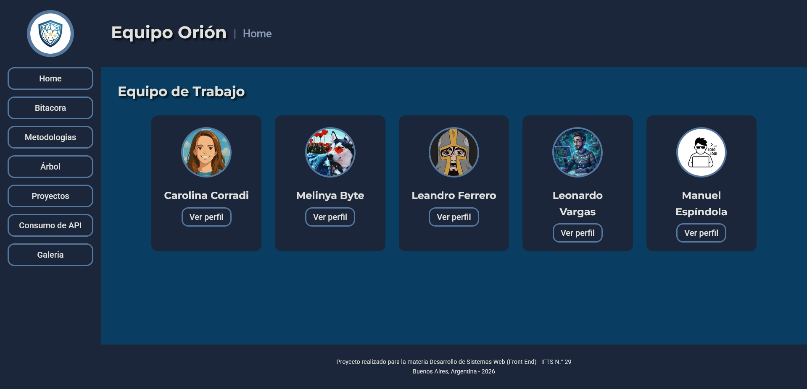
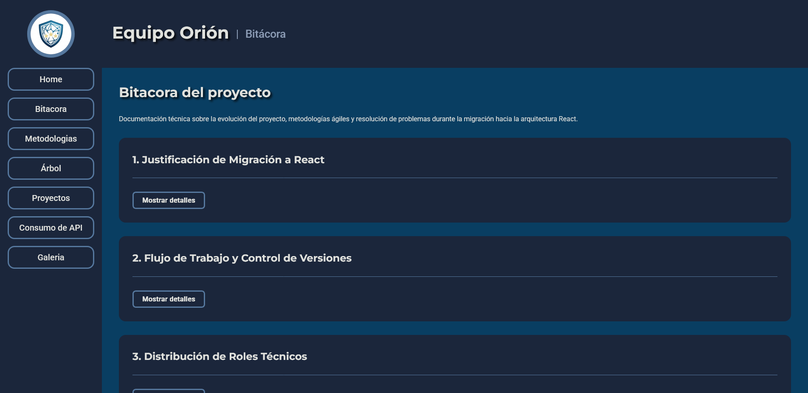
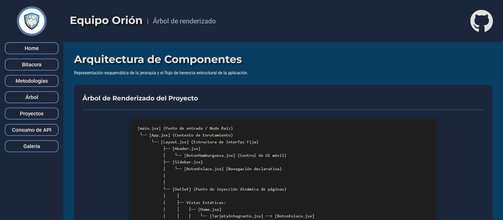
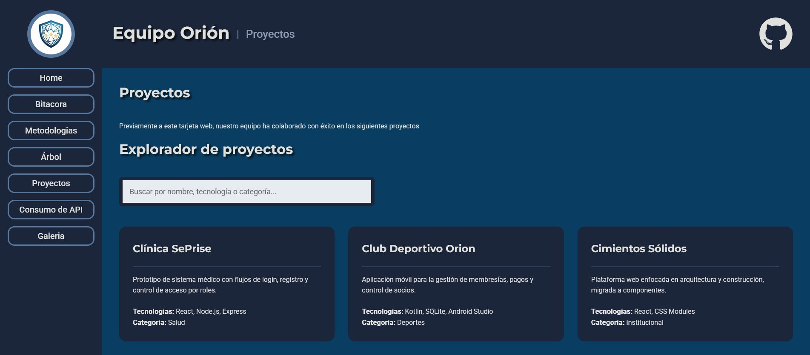
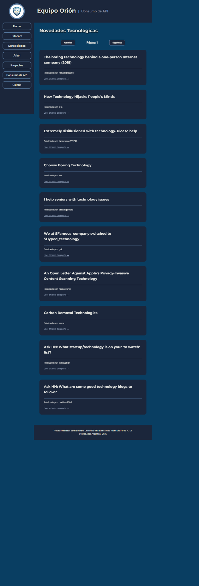
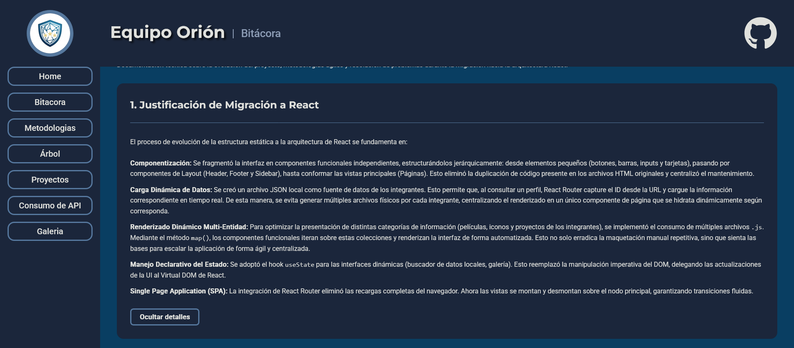
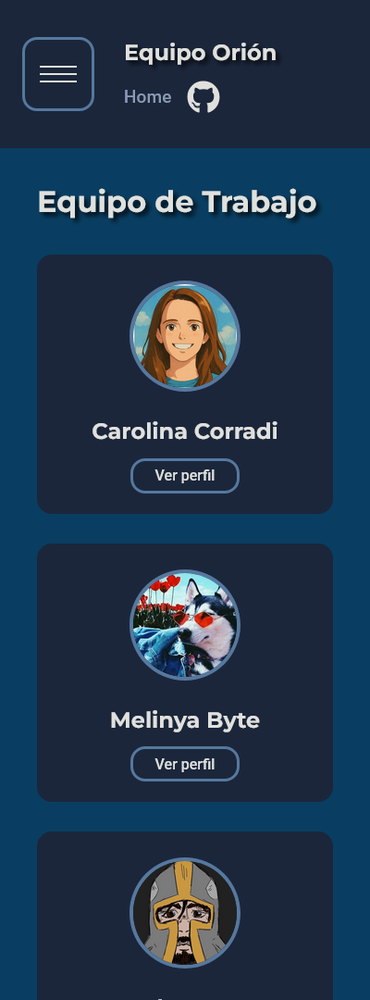
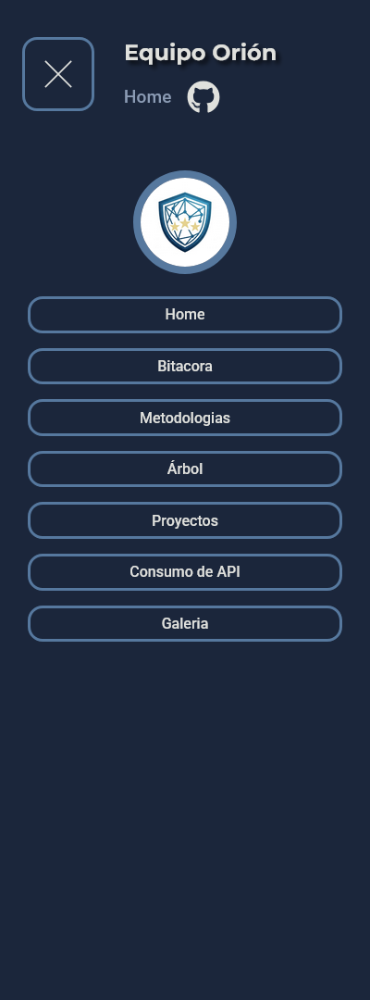
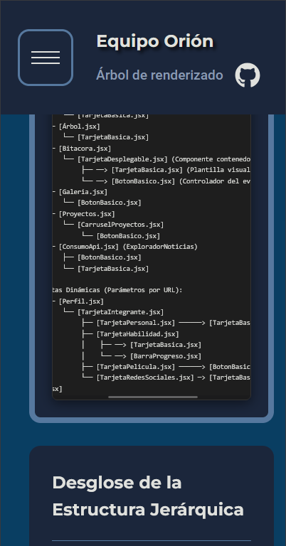

# Proyecto React del Equipo Orión - TP2

**Trabajo Práctico Grupal N.° 2 - Proyecto React en Equipo**
Materia: Desarrollo de Sistemas Web (Front End)
Institución: IFTS N.° 29

---

## Descripción del Proyecto

El presente trabajo práctico consiste en el desarrollo de una aplicación web del **Equipo Orión**, creada con **React** y **Vite** como evolución del Trabajo Práctico Grupal N.° 1, realizado originalmente con HTML, CSS y JavaScript.

El objetivo principal fue migrar una landing page estática hacia una **Single Page Application (SPA)** organizada en componentes reutilizables, con navegación mediante **React Router**, diseño adaptable, manejo de datos locales, consumo de API externa, perfiles individuales para cada integrante y secciones interactivas.

El sitio incluye una navegación lateral estilo dashboard, una portada con tarjetas de integrantes, páginas individuales de perfil, barras de progreso para habilidades, carrusel de proyectos, renderizado dinámico de datos desde archivos JSON, consumo de API externa con paginación, galería de imágenes, bitácora técnica y una representación de la arquitectura de componentes.

---

## Repositorio y enlace al Proyecto Desplegado

- [x] Repositorio en GitHub creado.
- [x] Proyecto desplegado en Vercel.

**Repositorio:**
https://github.com/leonardofvp/TP02-G16

**Enlace en Vercel:**
https://tp-02-g16.vercel.app/

---

## Integrantes del Equipo Orión

- [x] **Carolina Corradi** - [GitHub](https://github.com/carotramp)
- [x] **Manuel Espíndola** - [GitHub](https://github.com/Filogos)
- [x] **Leandro Ferrero** - [GitHub](https://github.com/LeaFerrero)
- [x] **Gabriela Gonzalez** - [GitHub](https://github.com/melinya-byte)
- [x] **Leonardo Vargas** - [GitHub](https://github.com/leonardofvp)

---

## Tecnologías Utilizadas

- [x] React
- [x] Vite
- [x] JavaScript
- [x] HTML
- [x] CSS
- [x] CSS Modules
- [x] React Router DOM
- [x] React Icons
- [x] React Slick
- [x] Slick Carousel
- [x] Google Fonts
- [x] Git
- [x] GitHub
- [x] Vercel

---

## Estructura de Archivos

El proyecto se organizó siguiendo buenas prácticas de desarrollo en *React*, separando componentes, páginas, datos, estilos, recursos visuales y funciones auxiliares.

```txt
TP02-G16/
├── .gitignore
├── eslint.config.js
├── index.html
├── package-lock.json
├── package.json
├── public/
│   └── favicon.png
├── README.md
├── src/
│   ├── App.jsx
│   ├── assets/
│   │   └── img/
│   │       ├── automatizador-de-reportes.avif
│   │       ├── capturas/
│   │       │   ├── api.png
│   │       │   ├── bitacora.png
│   │       │   ├── galeria.png
│   │       │   ├── home.png
│   │       │   ├── perfil.png
│   │       │   └── proyectos.png
│   │       ├── caro.png
│   │       ├── comunidad-del-anillo.webp
│   │       ├── configuraciones-manuales.png
│   │       ├── dashboard-pyme.png
│   │       ├── doss.jpg
│   │       ├── ecobudget-pro.jpg
│   │       ├── el-retorno-del-rey.webp
│   │       ├── enemigo.jpg
│   │       ├── escabio-interplanetario.png
│   │       ├── felicidad.webp
│   │       ├── imitacion.webp
│   │       ├── intime.jpg
│   │       ├── juegos-del-hambre-sinsajo.webp
│   │       ├── las-dos-torres.webp
│   │       ├── leandro-avatar.jpg
│   │       ├── leo.png
│   │       ├── logo-equipo.png
│   │       ├── manu.png
│   │       ├── matrix.jpg
│   │       ├── melinya-avatar.jpg
│   │       ├── menu-desplegado.png
│   │       ├── menu-plegado.png
│   │       ├── moneyball.webp
│   │       ├── orion.png
│   │       ├── palais.jpg
│   │       ├── pie-pequeño.webp
│   │       ├── promel1.png
│   │       ├── promel2.png
│   │       ├── promel3.jpg
│   │       ├── spacewars.png
│   │       └── tropa.jpg
│   ├── components/
│   │   ├── layout/
│   │   │   ├── footer/
│   │   │   │   ├── Footer.jsx
│   │   │   │   └── Footer.module.css
│   │   │   ├── header/
│   │   │   │   ├── Header.jsx
│   │   │   │   └── Header.module.css
│   │   │   ├── Layout.jsx
│   │   │   ├── Layout.module.css
│   │   │   └── sidebar/
│   │   │       ├── Sidebar.jsx
│   │   │       └── Sidebar.module.css
│   │   └── ui/
│   │       ├── barras/
│   │       │   ├── BarraProgreso.jsx
│   │       │   └── BarraProgreso.module.css
│   │       ├── botones/
│   │       │   ├── BotonBasico.jsx
│   │       │   ├── BotonBasico.module.css
│   │       │   ├── BotonEnlace.jsx
│   │       │   ├── BotonEnlace.module.css
│   │       │   ├── BotonHamburguesa.jsx
│   │       │   └── BotonMenuHamburguesa.module.css
│   │       ├── carrusel/
│   │       │   ├── CarruselProyectos.jsx
│   │       │   └── CarruselProyectos.module.css
│   │       ├── inputs-personalizados/
│   │       │   ├── InputBasico.jsx
│   │       │   └── InputBasico.module.css
│   │       └── tarjetas/
│   │           ├── TarjetaBasica.jsx
│   │           ├── TarjetaBasica.module.css
│   │           ├── TarjetaDesplegable.jsx
│   │           ├── TarjetaDesplegable.module.css
│   │           ├── TarjetaHabilidad.jsx
│   │           ├── TarjetaHabilidad.module.css
│   │           ├── TarjetaIntegrante.jsx
│   │           ├── TarjetaIntegrante.module.css
│   │           ├── TarjetaPelicula.jsx
│   │           ├── TarjetaPelicula.module.css
│   │           ├── TarjetaPersonal.jsx
│   │           ├── TarjetaPersonal.module.css
│   │           ├── TarjetaRedesSociales.jsx
│   │           └── TarjetaRedesSociales.module.css
│   ├── data/
│   │   ├── IntegrantesData.json
│   │   └── proyectos.json
│   ├── main.jsx
│   ├── pages/
│   │   ├── ArbolRenderizado.jsx
│   │   ├── ArbolRenderizado.module.css
│   │   ├── Bitacora.jsx
│   │   ├── Bitacora.module.css
│   │   ├── ConsumoApi.jsx
│   │   ├── ConsumoApi.module.css
│   │   ├── Galeria.jsx
│   │   ├── Galeria.module.css
│   │   ├── Home.jsx
│   │   ├── Home.module.css
│   │   ├── Metodologias.jsx
│   │   ├── Metodologias.module.css
│   │   ├── Perfil.jsx
│   │   ├── Perfil.module.css
│   │   ├── Proyectos.jsx
│   │   └── Proyectos.module.css
│   ├── styles/
│   │   └── global.css
│   └── utils/
│       ├── diccionarioAvatares.js
│       ├── diccionarioIconosHabilidades.jsx
│       ├── diccionarioImagenesPeliculas.js
│       └── diccionarioProyectosPersonales.js
└── vite.config.js

```

- [x] Carpeta `components` para componentes reutilizables.
- [x] Carpeta `layout` para la estructura general del sitio: layout, header, footer y sidebar.
- [x] Carpeta `ui` para tarjetas, botones, carrusel, barras de progreso e inputs.
- [x] Carpeta `pages` para las vistas principales de la aplicación.
- [x] Carpeta `data` para archivos JSON.
- [x] Carpeta `assets/img` para imágenes, avatares, logos y proyectos.
- [x] Carpeta styles: Directorio que almacena los estilos globales del sitio. Contiene la declaración de variables CSS, el reset básico del navegador y la configuración general de tipografías y colores.
- [x] Carpeta `utils` para diccionarios y funciones auxiliares.
- [x] Archivo `App.jsx` para la configuración principal de rutas.
- [x] Archivo `main.jsx` como punto de entrada de React.
- [x] Carpeta `assets/img/capturas` para las capturas utilizadas en el README.

---

## Funcionalidades Principales

### Navegación estilo Dashboard

- [x] La aplicación cuenta con una sidebar lateral fija.
- [x] La navegación permite acceder a las distintas secciones del proyecto.
- [x] Se utiliza React Router para gestionar las rutas internas de la SPA.
- [x] La sidebar funciona como eje estructural de navegación y organización de la experiencia de usuario.

---

### Home / Panel principal

- [x] La página principal presenta al Equipo Orión.
- [x] Se muestran tarjetas dinámicas de los integrantes.
- [x] Cada tarjeta permite acceder al perfil individual correspondiente.
- [x] Se aplican estilos visuales y transiciones para mejorar la experiencia de usuario.

---

### Perfiles individuales

Cada integrante cuenta con una página individual que funciona como perfil profesional dentro del sistema.

- [x] Nombre del integrante.
- [x] Descripción personal.
- [x] Edad y ubicación.
- [x] Habilidades técnicas.
- [x] Barras de progreso.
- [x] Carrusel de proyectos.
- [x] Películas favoritas.
- [x] Sección extra personalizada.
- [x] Redes sociales.

---

### Barras de progreso de habilidades

- [x] Las habilidades se renderizan dinámicamente desde `IntegrantesData.json`.
- [x] Cada habilidad incluye nombre, descripción y porcentaje.
- [x] Se utilizan barras visuales para representar el nivel de cada herramienta o tecnología.
- [x] Se incorporan íconos representativos mediante `diccionarioIconosHabilidades`.

Ejemplo de habilidades incluidas en un perfil:

- Python
- R
- HTML y CSS
- JavaScript
- MySQL

---

### Carrusel de proyectos

- [x] Cada perfil puede mostrar proyectos personales o conceptuales.
- [x] El carrusel permite navegar entre distintos trabajos.
- [x] Se utilizan imágenes en formato 16:9 para mantener coherencia visual.
- [x] Los proyectos se obtienen desde `diccionarioProyectosPersonales.js`.

---

### Renderizado dinámico de datos locales

- [x] Se utilizan archivos JSON para separar los datos de la interfaz.
- [x] La información de los integrantes se encuentra en `IntegrantesData.json`.
- [x] La información general de proyectos se encuentra en `proyectos.json`.
- [x] Esto permite mantener una estructura más ordenada, escalable y fácil de actualizar.

---

### Explorador de proyectos

- [x] La sección de proyectos renderiza información de manera dinámica.
- [x] `proyectos.json` contiene 20 objetos utilizados para el renderizado dinámico.
- [x] La vista permite explorar proyectos y tecnologías asociadas.
- [x] Búsqueda y filtrado en tiempo real por título, tecnología o categoría.

---

### Consumo de API externa

- [x] Se implementa consumo asíncrono de una API pública.
- [x] La sección cuenta con manejo de estado de carga.
- [x] Se contempla manejo de errores.
- [x] Se incluye paginación mediante botones de anterior y siguiente.
- [x] Se muestra el indicador de página actual.

---

### Galería de imágenes

- [x] Se incorporó una página de galería mediante `Galeria.jsx`.
- [x] Las imágenes utilizadas se encuentran organizadas dentro de `src/assets/img`.
- [x] La sección permite mostrar recursos visuales del los proyectos personales de los integranres.
- [x] Lightbox con ampliación visual, navegación interna y cierre mediante tecla ESC.

---

### Bitácora del proyecto

- [x] La aplicación incluye una sección de bitácora.
- [x] Se documenta el proceso de trabajo del equipo.
- [x] Se describen decisiones técnicas y organización general.
- [x] Se registra la evolución desde el TP1 hacia el TP2.

---

## Arquitectura de Componentes / Árbol de Renderizado

La aplicación parte desde el componente raíz `App.jsx`, donde se configuran las rutas principales mediante React Router.

```txt
TP02-G16/
├── .gitignore
├── eslint.config.js
├── index.html
├── package-lock.json
├── package.json
├── public/
│   └── favicon.png
├── README.md
├── src/
│   ├── App.jsx
│   ├── assets/
│   │   └── img/
│   │       ├── automatizador-de-reportes.avif
│   │       ├── capturas/
│   │       │   ├── api.png
│   │       │   ├── bitacora.png
│   │       │   ├── galeria.png
│   │       │   ├── home.png
│   │       │   ├── perfil.png
│   │       │   └── proyectos.png
│   │       ├── caro.png
│   │       ├── comunidad-del-anillo.webp
│   │       ├── configuraciones-manuales.png
│   │       ├── dashboard-pyme.png
│   │       ├── doss.jpg
│   │       ├── ecobudget-pro.jpg
│   │       ├── el-retorno-del-rey.webp
│   │       ├── enemigo.jpg
│   │       ├── escabio-interplanetario.png
│   │       ├── estereosenlanube.png
│   │       ├── felicidad.webp
│   │       ├── imitacion.webp
│   │       ├── intime.jpg
│   │       ├── juegos-del-hambre-sinsajo.webp
│   │       ├── las-dos-torres.webp
│   │       ├── leandro-avatar.jpg
│   │       ├── learnwithme.png
│   │       ├── leo.png
│   │       ├── logo-equipo.png
│   │       ├── manu.png
│   │       ├── matrix.jpg
│   │       ├── melinya-avatar.jpg
│   │       ├── menu-desplegado.png
│   │       ├── menu-plegado.png
│   │       ├── moneyball.webp
│   │       ├── orion.png
│   │       ├── palais.jpg
│   │       ├── pie-pequeño.webp
│   │       ├── promel1.png
│   │       ├── promel2.png
│   │       ├── promel3.jpg
│   │       ├── reparame.png
│   │       ├── spacewars.png
│   │       └── tropa.jpg
│   ├── components/
│   │   ├── layout/
│   │   │   ├── footer/
│   │   │   │   ├── Footer.jsx
│   │   │   │   └── Footer.module.css
│   │   │   ├── header/
│   │   │   │   ├── Header.jsx
│   │   │   │   └── Header.module.css
│   │   │   ├── Layout.jsx
│   │   │   ├── Layout.module.css
│   │   │   └── sidebar/
│   │   │       ├── Sidebar.jsx
│   │   │       └── Sidebar.module.css
│   │   └── ui/
│   │       ├── barras/
│   │       │   ├── BarraProgreso.jsx
│   │       │   └── BarraProgreso.module.css
│   │       ├── botones/
│   │       │   ├── BotonBasico.jsx
│   │       │   ├── BotonBasico.module.css
│   │       │   ├── BotonEnlace.jsx
│   │       │   ├── BotonEnlace.module.css
│   │       │   ├── BotonHamburguesa.jsx
│   │       │   └── BotonMenuHamburguesa.module.css
│   │       ├── carrusel/
│   │       │   ├── CarruselProyectos.jsx
│   │       │   └── CarruselProyectos.module.css
│   │       ├── inputs-personalizados/
│   │       │   ├── InputBasico.jsx
│   │       │   └── InputBasico.module.css
│   │       └── tarjetas/
│   │           ├── TarjetaBasica.jsx
│   │           ├── TarjetaBasica.module.css
│   │           ├── TarjetaDesplegable.jsx
│   │           ├── TarjetaDesplegable.module.css
│   │           ├── TarjetaHabilidad.jsx
│   │           ├── TarjetaHabilidad.module.css
│   │           ├── TarjetaIntegrante.jsx
│   │           ├── TarjetaIntegrante.module.css
│   │           ├── TarjetaPelicula.jsx
│   │           ├── TarjetaPelicula.module.css
│   │           ├── TarjetaPersonal.jsx
│   │           ├── TarjetaPersonal.module.css
│   │           ├── TarjetaRedesSociales.jsx
│   │           └── TarjetaRedesSociales.module.css
│   ├── data/
│   │   ├── IntegrantesData.json
│   │   └── proyectos.json
│   ├── main.jsx
│   ├── pages/
│   │   ├── ArbolRenderizado.jsx
│   │   ├── ArbolRenderizado.module.css
│   │   ├── Bitacora.jsx
│   │   ├── Bitacora.module.css
│   │   ├── ConsumoApi.jsx
│   │   ├── ConsumoApi.module.css
│   │   ├── Galeria.jsx
│   │   ├── Galeria.module.css
│   │   ├── Home.jsx
│   │   ├── Home.module.css
│   │   ├── Metodologias.jsx
│   │   ├── Metodologias.module.css
│   │   ├── Perfil.jsx
│   │   ├── Perfil.module.css
│   │   ├── Proyectos.jsx
│   │   └── Proyectos.module.css
│   ├── styles/
│   │   └── global.css
│   └── utils/
│       ├── diccionarioAvatares.js
│       ├── diccionarioIconosHabilidades.jsx
│       ├── diccionarioImagenesPeliculas.js
│       └── diccionarioProyectosPersonales.js
└── vite.config.js

```

- [x] App.jsx: componente raíz de la aplicación.
- [x] Layout: estructura general que contiene navegación y contenido.
- [x] Sidebar: menú lateral fijo.
- [x] BotonEnlace: componente para los enlaces de navegación.
- [x] BotonHamburguesa: control para desplegar el menú en móviles.
- [x] Header: encabezado del layout.
- [x] Outlet: espacio donde se renderizan las páginas internas según la ruta.
- [x] Home: página principal.
- [x] TarjetaIntegrante: componente para mostrar el resumen de cada miembro en el Home.
- [x] Perfil: página individual de cada integrante.
- [x] TarjetaPersonal: componente con los datos personales del integrante.
- [x] TarjetaHabilidad: componente para listar las competencias técnicas/blandas.
- [x] BarraProgreso: componente visual para representar el nivel de habilidades.
- [x] CarruselProyectos: componente reutilizable para mostrar proyectos.
- [x] TarjetaPelicula: componente para mostrar las películas favoritas.
- [x] TarjetaRedesSociales: componente con los enlaces de contacto.
- [x] BotonBasico: componente de interfaz reutilizable para disparar acciones.
- [x] Bitacora: vista del registro de actividades.
- [x] Metodologias: vista explicativa sobre la metodología de trabajo.
- [x] ArbolRenderizado: vista con el árbol de renderizado.
- [x] Proyectos: vista general con el explorador de todos los proyectos.
- [x] Galeria: vista ampliada de imágenes.
- [x] ConsumoApi: vista dedicada a la demostración de peticiones asíncronas.
- [x] Footer: pie de página común del proyecto.

---

## Uso de Hooks

El proyecto está construido íntegramente con componentes funcionales de React. La gestión del estado, la manipulación del DOM y la interceptación de rutas se manejan de forma estricta mediante Hooks, garantizando un ciclo de vida predecible sin mutaciones directas.

- **`useState`**: Implementado para la persistencia y actualización del estado local dentro del ciclo de vida de los componentes.
  - _Aplicación:_ Controla la renderización condicional de las interfaces de usuario. Se utiliza para manejar el estado lógico del menú de navegación móvil (`menuAbierto` / `toggleMenu`) y para almacenar el índice numérico de la imagen activa en el componente `Galeria` (`indiceActivo`), permitiendo la apertura, cierre y navegación del _Lightbox_ y y para expandir y contraer las tarjetas desplegables.

- **`useEffect`**: Utilizado para aislar y ejecutar efectos secundarios (operaciones que interactúan con APIs externas o el DOM global) fuera de la fase de renderizado puro de React.
  - _Aplicación:_ En el componente `Galeria`, se ejecuta de forma condicional al mutar el estado `indiceActivo`. Se encarga de suscribir y desuscribir eventos nativos del navegador (`window.addEventListener('keydown')`) para cerrar el _Lightbox_ con la tecla Escape. Además, manipula el CSS global (`document.body.style.overflow`) para bloquear y habilitar el scroll físico de la página. Incorpora siempre su respectiva función de retorno (_cleanup function_) para evitar fugas de memoria al desmontar el componente.

- **`useRef`**: Proporciona un contenedor persistente que permite almacenar valores mutables sin disparar un nuevo ciclo de renderizado. Facilita el acceso imperativo a instancias de componentes o elementos del DOM.
  - _Aplicación:_ Implementado en el componente CarruselProyectos para capturar la instancia del componente Slider de terceros (react-slick). Permite realizar un control imperativo de la navegación mediante la invocación directa de los métodos internos .slickNext() y .slickPrev() desde disparadores externos (botones de navegación personalizados). Esta estrategia garantiza el desacoplamiento entre la lógica de control y la estructura visual del carrusel, manteniendo la integridad del ciclo de vida de React al evitar re-renderizados innecesarios durante la manipulación de la instancia.

- **`useParams` (`react-router-dom`)**: Permite la lectura y extracción reactiva de los parámetros dinámicos definidos en el enrutador.
  - _Aplicación:_ Implementado en las vistas de renderizado dinámico (como las páginas individuales de perfil). Captura las variables inyectadas directamente en la estructura de la URL (por ejemplo, el valor de `:nombre` en una ruta parametrizada como `/perfil/:nombre`). Este valor extraído se utiliza posteriormente como clave de búsqueda para filtrar la información específica de cada integrante del equipo, permitiendo reutilizar un único componente funcional como plantilla para múltiples rutas.

- **`useLocation` (`react-router-dom`)**: Permite la lectura reactiva del objeto de ubicación del enrutador.
  - _Aplicación:_ Implementado en el componente `Header` para interceptar la URL actual del navegador (`location.pathname`). A través de lógica condicional y manipulación de strings (`split`, `charAt`, `toUpperCase`), extrae el segmento de la ruta para inyectar dinámicamente el título exacto de la vista actual ("Home", "Bitácora", "Galería" o el nombre formateado de cada perfil individual) en el encabezado de la aplicación.

---

## Funciones y Componentes Destacados

### `Perfil.jsx`

Componente de interfaz encargado del renderizado dinámico. Su función principal es capturar el parámetro de la ruta activa en la URL y estructurar visualmente la información en la pantalla. Actúa exclusivamente como una plantilla de presentación reutilizable, delegando el origen de la información a archivos externos para mantener el código limpio de contenido estructurado en duro (hardcodeado).

---

### `IntegrantesData.json`

Estructura de datos estática que actúa como la base de datos del lado del cliente. Centraliza las propiedades de cada miembro del equipo (datos personales y descripciones) en un formato predecible. Es la dependencia directa de la cual Perfil.jsx extrae la información exacta a mostrar, permitiendo actualizar o agregar miembros al proyecto sin necesidad de modificar el código de los componentes en React.

---

### `obtenerProyectosPersonales`

Función auxiliar encargada de extraer el listado de proyectos individuales de un integrante específico. Recibe como argumento el identificador del usuario, lo normaliza a minúsculas (`toLowerCase()`) para garantizar la coincidencia exacta de las claves, y consulta el diccionario de datos `diccionarioProyectosPersonales`. Retorna la información solicitada o `null` como valor de respaldo (fallback) en caso de que el identificador no exista.

```javascript
export const obtenerProyectosPersonales = (idIntegrante) => {
  return diccionarioProyectosPersonales[idIntegrante.toLowerCase()] || null;
};
```

---

### `CarruselProyectos`

Componente encargado de mostrar los proyectos personales de cada integrante en formato de carrusel interactivo.

---

### `diccionarioHabilidades.js`

Archivo auxiliar que actúa como un mapa para vincular las distintas habilidades técnicas con sus respectivos íconos. Esta estructura de datos contiene las referencias a los íconos de cada habilidad, permitiendo renderizarlos dinámicamente en los componentes. Esto desacopla la capa visual de la lógica, facilitando el mantenimiento de las tecnologías mostradas en la interfaz.

---

### `proyectos.json`

Estructura de datos en formato JSON dedicada a almacenar el catálogo de trabajos y desarrollos del equipo. Si bien los primeros tres proyectos fueron desarrollados genuinamente por el equipo, los demás fueron generados sintéticamente mediante Gemini 3.1 Pro para ser utilizados como datos de prueba en el filtrado de la sección de búsqueda. Provee la información estructurada necesaria para iterar y renderizar dinámicamente las tarjetas dentro de la sección de Proyectos.

---

## Guía de Estilos

### Paleta de Colores

- Color principal: `#093e62`
- Color secundario: `#1b263b`
- Color de detalles: `#415a77`
- Color de texto principal: `#e0e1dd`
- Color de texto secundario: `#8b9bb4`
- Color de acento: `#007bff`
- Color de error: `ff6b6b`

---

### Tipografías

- [x] Uso de Google Fonts.
- Títulos: Montserrat https://fonts.google.com/specimen/Montserrat.
- Cuerpo del texto: Roboto https://fonts.google.com/specimen/Roboto?query=roboto.

---

### Iconografía

- [x] Se utilizó la librería React Icons.
- [x] Los íconos representan tecnologías, redes sociales, navegación y habilidades.
- [x] Se aplicaron efectos visuales mediante CSS.

---

### Transiciones y efectos visuales

- [x] Efectos hover en botones.
- [x] Transiciones en tarjetas.
- [x] Animaciones de entrada.
- [x] Efectos visuales en enlaces, íconos y componentes interactivos.

---

## Capturas de Pantalla

A continuación se presentan capturas de las principales secciones del proyecto desplegado y algunas funcionalidades interactivas:

### Home / Dashboard principal



### Perfil individual


### Bitácora



### Árbol de renderizado



### Explorador de proyectos



### Consumo de API externa



### Tarjeta desplegada



### Menu hamburguesa para pantallas chicas



### Menu hamburguesa desplegado



### Desplazamiento horizontal del árbol de renderizado para pantallas chicas



---

## Evolución del Proyecto

Este TP2 representa una evolución directa del TP1. En la primera entrega, el proyecto fue desarrollado con HTML, CSS y JavaScript, utilizando páginas estáticas, estructura semántica, menú hamburguesa y tarjetas interactivas.

En esta segunda entrega, el proyecto fue migrado a React, permitiendo:

- [x] Separar la interfaz en componentes reutilizables.
- [x] Organizar las vistas mediante React Router.
- [x] Renderizar información desde archivos JSON.
- [x] Incorporar perfiles individuales dinámicos.
- [x] Agregar carruseles, barras de progreso y componentes visuales.
- [x] Mejorar la organización del código.
- [x] Facilitar el mantenimiento y la escalabilidad del proyecto.
- [x] Desplegar la aplicación en Vercel.

---

## Privacidad y Datos Personales

- [x] Algunos nombres, imágenes, avatares o recursos visuales pueden ser ficticios o representativos.
- [x] Las imágenes utilizadas en proyectos personales tienen fines académicos y de presentación visual.
- [x] La información publicada se utiliza únicamente para la entrega del trabajo práctico.

---

## Uso de Herramientas de Inteligencia Artificial

Para optimizar el proceso de desarrollo, resolver problemas técnicos y mejorar la presentación del proyecto, se integró el uso de herramientas de Inteligencia Artificial como asistente de apoyo, manteniendo la autoría y revisión final por parte del equipo.

### Herramientas utilizadas

- ChatGPT GPT-5.3.
- Gemini 3.1 Pro.
- Copilot, utilizado de forma puntual para sugerencias y correcciones menores de código.

---

### ChatGPT (GPT-5.3)

- **Lógica:** Revisión de errores de sintaxis en archivos JSON y JavaScript.
- **Contenido:** Apoyo en la redacción, revisión ortográfica y estructuración de las descripciones personales y de proyectos.
- **Contenido:** Mejora y formato de los textos generales para la documentación del README.

### Gemini (3.1 Pro)

- **Debugging:** Identificación y resolución de errores lógicos estructurales en el código.
- **UX/UI e Interfaz:** Asesoramiento en jerarquía visual, flujo de lectura y experiencia de usuario (ej. alineación contextual de filtros y manejo de estados vacíos). Resolución de conflictos de CSS Modules, incluyendo ajustes de `position: sticky` en el Sidebar, alineaciones con Flexbox y control de `aspect-ratio` en imágenes.
- **Imágenes:** Generación de imagen del logo y favicon.
- **Contenido:** Creación del archivo JSON con los proyectos extras del buscador.

### GitHub Copilot

- **Desarrollo:** Sugerencias predictivas de autocompletado en tiempo real dentro del entorno de desarrollo (IDE).
- **Desarrollo:** Correcciones tipográficas y sintácticas menores durante la escritura de los componentes de React.

---

## Instalación y Ejecución Local

Para ejecutar el proyecto localmente, se deben seguir los siguientes pasos:

```bash
npm install
npm run dev
```

Luego abrir en el navegador la URL indicada por Vite, generalmente:

```txt
http://localhost:5173/
```

En caso de que el puerto 5173 esté ocupado, Vite puede asignar otro puerto, como:

```txt
http://localhost:5174/
```

---

## Deploy

El proyecto fue desplegado en Vercel.

**Enlace al deploy:**
https://tp-02-g16.vercel.app/

---

## Estado Actual del Proyecto

- [x] Proyecto desarrollado con fines académicos.
- [x] Aplicación migrada a React.
- [x] Perfiles individuales implementados.
- [x] Carrusel de proyectos incorporado.
- [x] Datos organizados en archivos JSON.
- [x] Archivo `proyectos.json` con 20 objetos.
- [x] Búsqueda y filtrado en tiempo real implementados en la sección de proyectos.
- [x] Galería con lightbox, navegación interna y cierre mediante tecla ESC.
- [x] Seccion con árbol de renderizado.
- [x] Capturas incorporadas al README.
- [x] Proyecto publicado en Vercel.
- [x] README actualizado.
